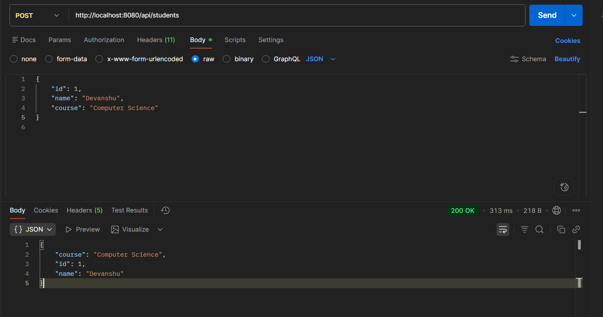
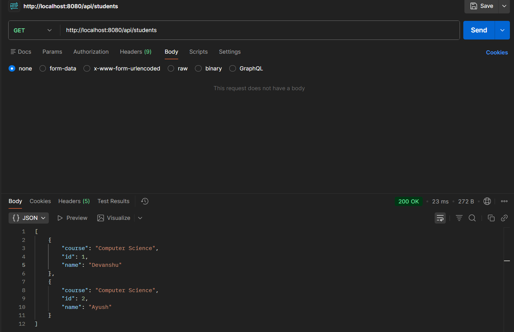
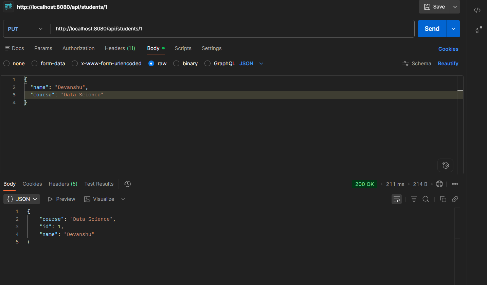
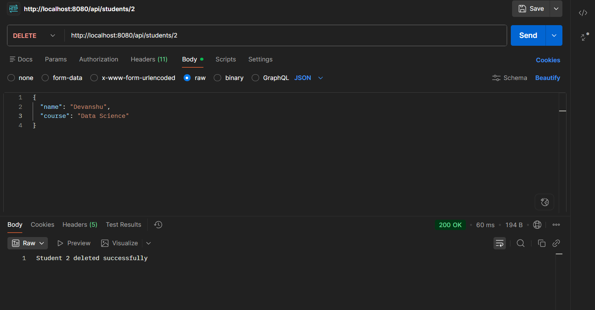

# 🎓 Experiment 8 – REST API with Spring Boot


A full-featured **Spring Boot REST API** project built with a clean layered MVC architecture. Supports complete **CRUD operations** via HTTP endpoints.

---

## 📁 Project Structure

```
Devanshu/demo/
├── 📂 controller/
│   └── StudentController.java     # Handles HTTP requests
├── 📂 model/
│   └── Student.java               # Entity / data class
├── 📂 repository/
│   └── StudentRepository.java     # Database access (JPA)
├── 📂 service/
│   └── StudentService.java        # Business logic
└── DemoApplication.java           # Main entry point
```

---

## ⚙️ Prerequisites

- Java **21**
- Maven
- MySQL running locally
- Postman (for testing)

---

## 🚀 Getting Started

### 1. Clone the Repository
```bash
git clone https://github.com/your-username/your-repo-name.git
cd "Exp - 8"
```

### 2. Configure Database
Edit `src/main/resources/application.properties`:
```properties
spring.datasource.url=jdbc:mysql://localhost:3306/your_db_name
spring.datasource.username=root
spring.datasource.password=yourpassword
spring.jpa.hibernate.ddl-auto=update
spring.jpa.show-sql=true
```

### 3. Run the Project
```bash
# Linux / Mac
./mvnw spring-boot:run

# Windows
mvnw.cmd spring-boot:run
```

Server starts at → `http://localhost:8080`

---

## 🔗 API Endpoints

Base URL: `http://localhost:8080/api/students`

| Method | Endpoint | Description |
|:------:|----------|-------------|
|  | `/api/students` | Fetch all students |
|  | `/api/students/{id}` | Fetch student by ID |
|  | `/api/students` | Add new student |
|  | `/api/students/{id}` | Update student |
|  | `/api/students/{id}` | Delete student |
---

## 📦 Sample Request Body

**POST / PUT** → `Content-Type: application/json`
```json
{
  "id": 1,
  "name": "Devanshu",
  "course": "Computer Science"
}
```

---

## 📸 Screenshots

### ➕ POST – Add Student


### 📋 GET – All Students


### ✏️ PUT – Update Student


### 🗑️ DELETE – Delete Student



---

## 🛠️ Built With

- [Spring Boot](https://spring.io/projects/spring-boot) – Backend framework
- [Spring Data JPA](https://spring.io/projects/spring-data-jpa) – Database ORM
- [MySQL](https://www.mysql.com/) – Relational database
- [Maven](https://maven.apache.org/) – Dependency management

---

## 👨‍💻 Author

**Devanshu**  
[](https://github.com/Devanshu11976)

---

## 📄 License

This project is for educational purposes only.
